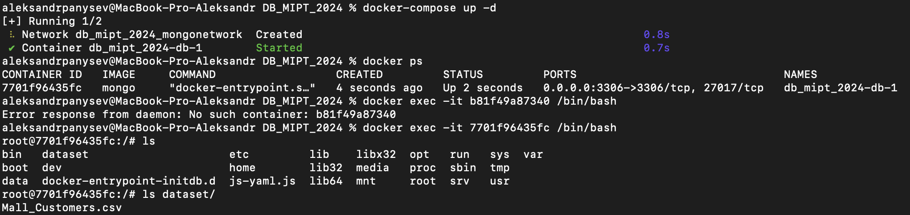

# DB_MIPT_2024

- Скачал датасет customer segmentation

- Написал docker-compose с образом mongo и датасетом

- Поднял контейнер

- Закачал датасет

- mongosh

- findOne

- insert

- update

- delete

- индексы
- замерим сначала без индексов

- создадим индекс

- замерим с индексом

- датасет маленький, поэтому по времени  не видно улучшения, но видно что totalDocsExamined стал меньше